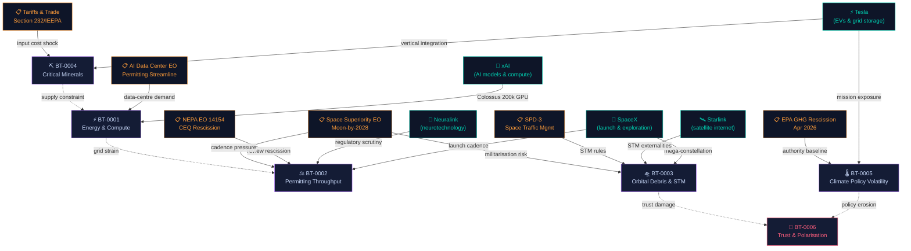
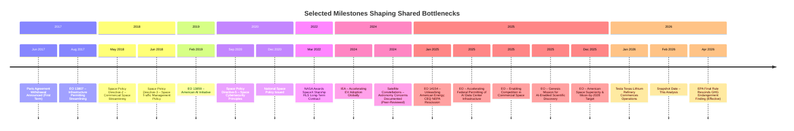

# 🌍 Planetary Bottlenecks: Benevolence & Security Intelligence

> *Mapping where Musk-company execution vectors and Trump-era federal policy share critical chokepoints — and where those chokepoints threaten or enable civilisational wellbeing and catastrophic-risk reduction.*

<!-- Status badges -->


---

## 📋 Table of Contents

- [Executive Summary](#-executive-summary)
- [Working Definitions](#-working-definitions)
- [Methodology](#-methodology)
- [Entity Relationships](#-entity-relationships)
- [Policy Timeline](#-policy-timeline-2017–2026)
- [The Six Bottlenecks](#-the-six-bottlenecks)
  - [BT-0001 · Energy & Compute](#bt-0001--energy--compute-as-a-binding-constraint)
  - [BT-0002 · Permitting Throughput](#bt-0002--permitting-throughput--litigation-risk)
  - [BT-0003 · Orbital Debris & STM](#bt-0003--orbital-debris--space-traffic-management)
  - [BT-0004 · Critical Minerals](#bt-0004--critical-minerals--industrial-base-fragility)
  - [BT-0005 · Climate Policy Volatility](#bt-0005--climate-policy-volatility--authority-baseline)
  - [BT-0006 · Trust & Polarisation](#bt-0006--trust-polarisation--epistemic-bottlenecks)
- [Impact Matrix](#-impact-matrix)
- [Mitigation Playbook](#-mitigation-playbook)
- [Data Schema](#-data-schema)
- [Repository Blueprint](#-repository-blueprint)
- [Contribution Guide](#-contribution-guide)
- [Licence & Attribution](#-licence--attribution)
- [Zero Harm & Anti-Coercion](#️-zero-harm--anti-coercion)

---

## 🔭 Executive Summary

As of **February 25, 2026**, Donald Trump is the sitting U.S. President. Federal executive actions after January 2025 are directly part of the "latest available" policy surface, and many of those actions explicitly target the same **industrial chokepoints** that the Musk-linked company portfolio confronts: space launch cadence and licensing, satellite governance, AI compute buildout, energy infrastructure, and critical-mineral supply chains.

Using **planetary benevolence** as a wellbeing-within-planetary-boundaries objective and **planetary security** as a catastrophic-risk and human-security objective, the most consequential shared bottlenecks cluster into **six patterns**:

| # | Bottleneck | Benevolence | Security | Coupling |
|---|-----------|:-----------:|:--------:|:--------:|
| 1 | Energy & Compute Constraint | ⚡ Mixed | ⚡ Mixed | `★★★★★` |
| 2 | Permitting Throughput | 🔴 Negative | ⚡ Mixed | `★★★★☆` |
| 3 | Orbital Debris & STM | 🔴 Negative | 🟢 Positive | `★★★☆☆` |
| 4 | Critical Minerals Fragility | ⚡ Mixed | 🟢 Positive | `★★★★☆` |
| 5 | Climate Policy Volatility | 🔴 Negative | ⚡ Mixed | `★★★★★` |
| 6 | Trust & Polarisation | 🔴 Negative | 🔴 Negative | `★★★☆☆` |

Mitigations that appear consistently high-leverage across bottlenecks include **build-to-audit architectures**, **permit-to-standard governance**, **multi-stakeholder space commons coordination**, and **industrial resilience compacts**.

---

## 📐 Working Definitions

<table>
<tr>
<th width="50%">🌱 Planetary Benevolence</th>
<th width="50%">🛡️ Planetary Security</th>
</tr>
<tr>
<td>

The sustained improvement of human wellbeing and capability while maintaining Earth-system stability and minimising irreversible harms. Grounded in the **safe operating space for humanity** concept (planetary boundaries) and the **planetary health** framing that links civilisation's health to natural systems.

**Operationally covers:** rapid decarbonisation, resilient infrastructure, broad connectivity access, reduced accident/injury burdens, improved health capabilities, and transparent rights-respecting governance.

</td>
<td>

Reduction of the probability and severity of global catastrophic harms to human survival, freedom, and long-run potential — combining the **UNDP notion of human security** with **existential/global-catastrophic risk frameworks** concerned with civilisation-scale failure modes.

**Operationally covers:** cyber/space infrastructure resilience, conflict escalation control, deterrence stability, biosecurity and public-health capability, and management of advanced-technology risks, notably AI.

</td>
</tr>
</table>

---

## 🔬 Methodology

The analysis follows a **two-sided bottleneck mapping** procedure, applied across a source hierarchy (highest to lowest):

```
① Capability vectors:  Extract each company's stated mission and major operational dependencies
② Policy vectors:      Identify federal initiatives that directly shape those dependencies
③ Bottleneck taxonomy: Classify into 7 domains (see below)
④ Impact scoring:      Qualitative effect direction on (a) benevolence and (b) security
⑤ Mitigation design:   Technical / Policy / Governance — with feasibility and reversibility notes
```

**Source hierarchy:** Primary government sources → Primary company sources → Original academic/synthesis research → Policy think tanks & standards bodies → Mainstream press (corroboration only)

**Seven analytical domains:**

```
┌─────────────────────┬─────────────────────┬───────────────────────┐
│ 1. Technological    │ 2. Regulatory/Legal  │ 3. Economic/Finance   │
├─────────────────────┼─────────────────────┼───────────────────────┤
│ 4. Supply Chain     │ 5. Governance/Coord. │ 6. Social/Ethical     │
├─────────────────────┴─────────────────────┴───────────────────────┤
│ 7. Security/Risk                                                   │
└────────────────────────────────────────────────────────────────────┘
```

---

## 🕸️ Entity Relationships

The diagram below shows how company capability vectors and federal policy vectors converge on shared bottlenecks. Node size represents coupling intensity; edge weight represents dependency strength.



---

## 📅 Policy Timeline 2017–2026



---

## 🔩 The Six Bottlenecks

> **How to read these entries:** each bottleneck is evaluated through both planetary lenses simultaneously, because they frequently diverge — and that divergence is analytically critical. Mitigations are tagged `[T]` technical, `[P]` policy, or `[G]` governance.

---

### BT-0001 · Energy & Compute as a Binding Constraint

   

**The chokepoint in one sentence:** AI scaling and electrification are hitting a shared ceiling in grid capacity, permitting speed, and energy supply mix — and the policy response accelerates demand while the physical infrastructure lags.

**Company-side evidence:** xAI's own materials describe rapid buildout of Colossus, scaled to 200,000 GPUs, while the IEA projects data-centre electricity consumption roughly doubling by 2030. Tesla's electrification ecosystem depends on a reliable grid that this same AI boom is straining.

**Policy-side evidence:** The AI data-centre permitting EO explicitly eases regulatory burdens to build data centres and high-voltage transmission; reportage ties the AI boom to grid constraints and describes Trump pushing self-supply by tech firms — an acknowledgement that the grid cannot absorb demand as planned.

<details>
<summary><strong>💡 Impact analysis</strong></summary>

For **planetary benevolence**, the bottleneck is double-edged: AI-enabled discovery can accelerate beneficial outcomes (climate modelling, drug discovery, grid optimisation), but if incremental power comes from high-emissions sources under weakened environmental controls, it directly conflicts with planetary-boundary goals. The net direction is *mixed*, with the outcome contingent on the energy mix.

For **planetary security**, grid scarcity and congestion produce strategic vulnerability when both civil infrastructure and defence-relevant compute depend on constrained nodes. A large-scale grid event at a compute-dense hub would be simultaneously an economic and national-security shock.

</details>

<details>
<summary><strong>🛠️ Mitigations</strong></summary>

`[T]` Co-locate data centres with low-carbon firm generation; integrate demand response; pursue waste-heat reuse and hardware efficiency as first-class KPIs rather than afterthoughts.

`[P]` Require grid-impact disclosures and mitigation plans for GW-scale data-centre projects before approvals; accelerate grid interconnection processes *without* eliminating environmental safeguards.

`[G]` Treat compute-dense data centres as critical infrastructure subject to resilience standards — N-1 redundancy, cyber baselines, and independent operational audits.

</details>

---

### BT-0002 · Permitting Throughput & Litigation Risk

   

**The chokepoint in one sentence:** Federal efforts to speed up permitting by weakening review processes generate legitimacy deficits and litigation spirals that ultimately *slow* the very projects they target.

**Company-side evidence:** FAA tiered environmental assessments and mishap/return-to-flight determinations explicitly govern Starship launch cadence. Public comment cycles, environmental review timeframes, and mishap investigations are not bureaucratic friction — they are the operational gating mechanisms for the world's largest launch programme.

**Policy-side evidence:** EO 14154 directs CEQ NEPA regulatory rescission and positions this as "unleashing energy." A separate 2025 EO targets rapid AI data-centre permitting. Both moves have attracted litigation within months of implementation.

<details>
<summary><strong>💡 Impact analysis</strong></summary>

For **planetary benevolence**, weakened process reduces the legitimacy of resulting decisions, making durable deployment harder. Acceleration that bypasses public health and environmental review can generate harms that erode trust in the very technologies being deployed. For **planetary security**, faster deployment *can* strengthen defence and resilience — but poor process creates systemic hazards (launch accidents, debris cascades, data-centre grid shocks) that degrade strategic stability.

</details>

<details>
<summary><strong>🛠️ Mitigations</strong></summary>

`[T]` Design-for-disposal satellites; robust launch safety analyses; debris containment from the engineering stage, not as regulatory add-on.

`[P]` Predictable licensing SLAs *coupled* to enforceable sustainability constraints — deorbit metrics, debris liabilities, grid-impact bonds. Speed and accountability are not opposites.

`[G]` Independent STM reporting and shared data infrastructure to reduce the informational asymmetry that makes process cuts feel justified.

</details>

---

### BT-0003 · Orbital Debris & Space Traffic Management

   

**The chokepoint in one sentence:** Mega-constellations scale the externalities of orbital congestion faster than governance frameworks can adapt — and this is simultaneously a science/commons problem and a national-security dependency.

**Company-side evidence:** Starlink's constellation expansion raises congestion and debris stakes at a rate that is structurally new. Peer-reviewed research documents that large satellite constellations contaminate space-telescope images — demonstrating that the space commons is already experiencing irreversible-adjacent harm.

**Policy-side evidence:** FCC orbital-debris rules now embed a five-year post-mission disposal expectation for many LEO systems. SPD-3 sets STM priorities but operational coordination remains multi-actor and fragmented. International coordination proceeds through ITU registration processes — a system designed for a pre-mega-constellation era.

<details>
<summary><strong>💡 Impact analysis</strong></summary>

The divergence between lenses is sharp here. For **planetary benevolence**, degraded space commons harms Earth observation, climate monitoring, and astronomy science — all of which serve long-term civilisational wellbeing. For **planetary security**, space infrastructure has become a strategic military asset, and its congestion increases vulnerability of national-security assets while raising collision and misattribution complexity in a crisis.

</details>

<details>
<summary><strong>🛠️ Mitigations</strong></summary>

`[G]` Create interoperable STM data standards; mandate conjunction reporting as a baseline condition of orbital operations; align domestic rules with ITU processes.

`[T]` Brightness mitigation and lower-reflectivity satellite design (acknowledging this remains contested and evolving). Transparency requirements for autonomous manoeuvring.

`[G]` Confidence-building measures and explicit norms prohibiting debris-creating tests; strengthen STM as "risk-reduction infrastructure" in the same way nuclear safety infrastructure is treated.

</details>

---

### BT-0004 · Critical Minerals & Industrial Base Fragility

   

**The chokepoint in one sentence:** Lithium, cobalt, nickel, rare earths, and advanced semiconductors are simultaneously a clean-energy-transition bottleneck and a national-security bottleneck — and attempts to solve one can worsen the other.

**Company-side evidence:** Tesla's SEC filings emphasise supply-chain de-risking and vertical integration; the Texas lithium refinery commencing operations in January 2026 is the most concrete recent signal of corporate strategy responding to this bottleneck directly. xAI's compute build and the broader AI boom represent enormous semiconductor demand that is simultaneously a civilian and defence-relevant resource.

**Policy-side evidence:** EO 13817 frames critical minerals as a strategic vulnerability. Second-term initiatives described in reporting include Pentagon-developed AI tools to create reference prices for critical minerals — an extraordinary step that indicates policy interest in reshaping market structure itself.

<details>
<summary><strong>💡 Impact analysis</strong></summary>

For **planetary benevolence**, mineral bottlenecks slow electrification and energy transition, directly undermining emissions reduction pathways. For **planetary security**, concentrated supply chains can be leveraged coercively, but attempts to counter-concentrate via tariffs or state intervention can intensify economic confrontation and raise escalation risk.

</details>

<details>
<summary><strong>🛠️ Mitigations</strong></summary>

`[T]` Design for lower-criticality chemistries; expand secondary supply and materials substitution; invest in end-of-life recycling at scale.

`[P]` Diversify supply via allied sourcing with transparent environmental and social standards — avoid "security fixes" that increase local harm in producing nations.

`[G]` Critical minerals provenance metadata requirements for federal procurement and defence supply chains; multi-nation industrial resilience compacts.

</details>

---

### BT-0005 · Climate Policy Volatility & Authority Baseline

   

**The chokepoint in one sentence:** The EPA's rescission of the 2009 GHG endangerment finding removes the federal regulatory authority baseline for emissions standards — fragmenting policy signals and dramatically increasing long-run climate risk.

**Policy-side evidence:** EPA states that rescinding the endangerment finding removes the Clean Air Act Section 202(a) basis for prescribing vehicle GHG standards. The Federal Register final action explicitly rescinds the finding and repeals vehicle GHG standards for multiple classes, effective April 20, 2026. Litigation was filed immediately.

**Company-side evidence:** Tesla's business and mission are explicitly tied to accelerating sustainable energy. In a world where federal emissions standards are removed, policy-driven demand signals become more state-driven and globally fragmented, increasing business-model uncertainty for the company most aligned with the benevolence objective.

<details>
<summary><strong>💡 Impact analysis</strong></summary>

For **planetary benevolence**, climate mitigation is a central planetary-boundary stabiliser. IPCC emphasises steep emissions reductions for 1.5°C-consistent pathways; reductions in regulatory capacity raise long-run benevolence risk in a way that compounds with every year of delay. For **planetary security**, climate change is treated in catastrophic-risk assessments as a global catastrophe *contributor* — through resource stress, disaster cascades, and displacement. Weakening mitigation can increase long-range destabilisation channels.

</details>

<details>
<summary><strong>🛠️ Mitigations</strong></summary>

`[P]` Replace unstable authority fights with durable, technology-neutral performance standards enacted through legislation rather than administrative rulemaking where feasible.

`[G]` Build state–federal compacts and multi-level governance mechanisms to reduce regulatory oscillation risk; explicitly track reversal risk in investment and planning decisions.

`[P]` Maintain transparent cost–benefit and health-impact accounting as a public record, regardless of whether rule-making proceeds — this provides the evidence base for reversal when political conditions change.

</details>

---

### BT-0006 · Trust, Polarisation & Epistemic Bottlenecks

   

**The chokepoint in one sentence:** Misinformation, societal polarisation, and eroded institutional trust behave like *hard technical bottlenecks* for goals that require durable cooperation — which is to say, almost all planetary-scale goals.

**Evidence:** WEF consistently ranks misinformation/disinformation and societal polarisation among top near-term risks. Local opposition delays data centres due to perceived harms around energy costs, water use, and noise — demonstrating that social consent is already an operational constraint, not a soft externality. AI policy debates framing safety concerns as "bias" further fragment the epistemic commons.

<details>
<summary><strong>💡 Impact analysis</strong></summary>

For **planetary benevolence**, decarbonisation and public-health resilience require broad, durable buy-in across administrations and electoral cycles. Polarisation raises reversal odds and slows deployment of beneficial infrastructure by making every project a political battleground. For **planetary security**, polarisation increases vulnerability to information operations and complicates crisis decision-making at exactly the moments when coherent, rapid response is most critical.

</details>

<details>
<summary><strong>🛠️ Mitigations</strong></summary>

`[G]` Radical transparency on externalities — grid impacts, emissions, debris risk, water use — published as open, third-party-validated data rather than managed corporate communications.

`[G]` Participatory planning processes for high-impact infrastructure; communities have more tolerance for projects they helped shape.

`[T]` Open public dashboards; third-party measurement standards; incident reporting requirements that make system performance legible to non-expert audiences.

</details>

---

## 📊 Impact Matrix

Full comparative view across all six bottlenecks and seven analytical domains.

| Bottleneck | Tech | Reg/Legal | Econ | Supply | Gov | Social | Security | B-Impact | S-Impact | Confidence |
|---|:---:|:---:|:---:|:---:|:---:|:---:|:---:|:---:|:---:|:---:|
| Energy & Compute | ●●● | ●●○ | ●●● | ●●○ | ●●○ | ●○○ | ●●● | ⚡ Mixed | ⚡ Mixed | Medium |
| Permitting & Litigation | ●○○ | ●●● | ●●○ | ○○○ | ●●● | ●●○ | ●●○ | 🔴 Neg | ⚡ Mixed | High |
| Orbital Debris & STM | ●●● | ●●○ | ●○○ | ○○○ | ●●● | ●●○ | ●●● | 🔴 Neg | 🟢 Pos | Medium |
| Critical Minerals | ●●○ | ●○○ | ●●● | ●●● | ●●○ | ●○○ | ●●● | ⚡ Mixed | 🟢 Pos | High |
| Climate Policy Volatility | ○○○ | ●●● | ●●● | ●○○ | ●●● | ●●○ | ●●○ | 🔴 Neg | ⚡ Mixed | High |
| Trust & Polarisation | ●○○ | ●○○ | ●●○ | ○○○ | ●●● | ●●● | ●●○ | 🔴 Neg | 🔴 Neg | Medium |

*Domain intensity: `●●●` highly coupled · `●●○` moderate · `●○○` tangential · `○○○` not applicable*

---

## 🛠️ Mitigation Playbook

Four intervention archetypes appear consistently high-leverage across multiple bottlenecks simultaneously.

### ⚙️ Build-to-Audit Architecture `[Technical]`

Verifiable safety cases with measurable hazard analyses; open telemetry feeds and transparent incident reporting for critical services; third-party red-teaming as a standard operational requirement rather than a one-time event. Applies directly to: BT-0001, BT-0002, BT-0003, BT-0006.

### 📋 Permit-to-Standard Governance `[Policy]`

Predictable licensing timelines *tied* to measurable environmental and safety performance metrics. Speed and accountability are not opposites — the key insight is that regulatory predictability is itself an accelerant, because it removes the litigation risk that unpredictable or weakened processes introduce. Applies directly to: BT-0002, BT-0005.

### 🛸 Space Commons Coordination `[Governance]`

Interoperable STM, debris, and spectrum data-sharing compacts. Multi-stakeholder norms for conjunction reporting. Explicit prohibition norms for debris-creating tests. Treat space traffic management as risk-reduction infrastructure in the same way nuclear safety protocols are treated — not as competitive advantage. Applies directly to: BT-0003.

### 🤝 Industrial Resilience Compacts `[Policy + Governance]`

Critical-mineral provenance standards; end-of-life recycling mandates; diversified allied sourcing with transparent environmental and social standards; alliance-based procurement for defence-relevant materials. The goal is supply resilience *without* the geopolitical confrontation that purely nationalist reshoring tends to generate. Applies directly to: BT-0004, BT-0001.

---

## 📦 Data Schema

Each bottleneck page is generated from a structured JSON record in `docs/data/bottlenecks/`. Adding a new bottleneck means adding a single file that conforms to the schema below — the build script handles cross-linking, card generation, and timeline integration automatically.

```json
{
  "id": "BT-0001",
  "title": "Energy and compute as a binding constraint",
  "domains": ["technological", "economic/finance", "security/risk"],
  "summary": "AI-scale and electrification are constrained by grid capacity...",

  "company_examples": [
    {
      "company": "xAI",
      "program": "Colossus",
      "claim": "Scaled to 200k GPUs in <1 year (per xAI).",
      "sources": [
        {
          "type": "primary",
          "title": "xAI Colossus page",
          "url": "https://x.ai/colossus",
          "date": "2026-02-25"
        }
      ]
    }
  ],

  "policy_examples": [
    {
      "policy": "Accelerating Federal Permitting of AI Data Center Infrastructure",
      "jurisdiction": "US federal",
      "mechanism": "Executive Order",
      "date": "2025-07-23",
      "sources": [
        {
          "type": "primary",
          "title": "White House EO",
          "url": "https://www.whitehouse.gov/presidential-actions/..."
        }
      ]
    }
  ],

  "impact_assessment": {
    "planetary_benevolence": {
      "direction": "mixed",
      "mechanisms": ["innovation acceleration", "emissions risk via power mix", "water/land impacts"]
    },
    "planetary_security": {
      "direction": "mixed",
      "mechanisms": ["strategic capability", "grid fragility", "critical infrastructure risk"]
    }
  },

  "mitigations": [
    { "type": "technical",   "action": "Adopt compute-efficiency KPIs and demand-response integration." },
    { "type": "policy",      "action": "Require grid-impact disclosure + mitigation plans for GW-scale data centers." },
    { "type": "governance",  "action": "Independent audits for critical infrastructure AI deployments." }
  ],

  "stakeholders": ["SH-0001", "SH-0002"],
  "last_updated": "2026-02-25",
  "confidence": "medium"
}
```

---

## 🗂️ Repository Blueprint

```
planetary-benevolence-security-bottlenecks/
│
├── README.md                          ← This file
├── LICENSE-CODE                       ← MIT
├── LICENSE-CONTENT                    ← CC BY 4.0
├── CODE_OF_CONDUCT.md
├── CONTRIBUTING.md
├── SECURITY.md
├── CITATION_POLICY.md
│
├── docs/
│   ├── index.html
│   ├── assets/ (css/ js/ img/)
│   └── data/
│       ├── bottlenecks/
│       │   ├── BT-0001-energy-compute.json
│       │   ├── BT-0002-permitting-throughput.json
│       │   └── ...
│       ├── stakeholders/
│       │   ├── SH-0001-federal-agencies.json
│       │   └── SH-0002-industry.json
│       ├── sources/
│       │   ├── 2017-2021/
│       │   └── 2025-2026/
│       └── diagrams/
│           ├── entity-relationships.mmd
│           └── timeline.mmd
│
├── research/
│   ├── methods/
│   │   ├── methodology.md
│   │   └── scoring-rubric.md
│   └── memos/
│       └── 2026-02-25-snapshot.md
│
└── .github/
    ├── ISSUE_TEMPLATE/
    │   ├── new-bottleneck.yml
    │   ├── add-evidence.yml
    │   └── policy-update.yml
    ├── PULL_REQUEST_TEMPLATE.md
    └── workflows/
        ├── validate-json.yml
        ├── build-docs.yml
        └── link-check.yml
```

---

## 🤝 Contribution Guide

### Core Principles

Every non-trivial claim must cite a primary source *or* a reputable synthesis (IPCC / IEA / NIST / RAND). Keep direct quotes short and prefer paraphrase with citation. Describe policy and corporate actions in neutral language, separating facts from interpretation. Do not include instructions that could enable wrongdoing of any kind.

### Required for Every PR

1. Add or update a bottleneck JSON in `docs/data/bottlenecks/`
2. Add sources in `docs/data/sources/` with URL + date accessed
3. Update `docs/diagrams/` if entity relationships change
4. Run `tools/scripts/validate.js` (CI enforces this automatically)

### Repeatable Contributor Prompt Chains

These meta-prompt chains are designed for low-ambiguity, repeatable expansion of the knowledge base:

**Chain A — Add a policy-to-bottleneck record:**
> *"Find the primary text for [policy name] and extract: date, authority, key operative sections, and implementation agencies. Output as JSON."* → *"Map which bottleneck IDs it touches and why."* → *"Check: (a) primary source link present, (b) no uncited claims, (c) neutral language."*

**Chain B — Add a company constraint record:**
> *"From the latest annual report for [company], extract explicit constraints (permits, materials, compute, regulators) with citations."* → *"Convert each constraint into a bottleneck linkage with short rationale."* → *"Propose one technical mitigation and one governance mitigation; label as speculative unless sourced."*

**Chain C — Maintain the timeline:**
> *"For [date range], list all new EOs/final rules relevant to AI, space, NEPA, critical minerals, or climate."* → *"Update timeline.mmd with only items that change a bottleneck pressure."* → *"Add citations and link each node to a source record."*

---

## 📚 Licence & Attribution

| Asset | Licence |
|---|---|
| All code (scripts, schemas, build tools) | [MIT Licence](./LICENSE-CODE) |
| All content (research narrative, diagrams, analysis) | [Creative Commons Attribution 4.0 (CC BY 4.0)](./LICENSE-CONTENT) |

When citing this work, please include the snapshot date (Feb 25, 2026) alongside your citation, as the policy landscape evolves rapidly and provenance matters.

---

## 🛡️ Zero Harm & Anti-Coercion

This repository is designed and maintained to serve **public understanding and constructive policy analysis**. It contains no tracking, no hidden telemetry, no surveillance features, and no manipulative design patterns. No personal data is collected or stored.

Any content or functionality that could be repurposed for coercion, targeted harassment, surveillance, or manipulation has been deliberately excluded. All sources are publicly cited. All analysis is reversible and contestable.

**When in doubt, this project chooses safety, clarity, and human wellbeing over power or complexity.**

---

<div align="center">

*Planetary Restoration Archive · Open Research, Open Source*


</div>
